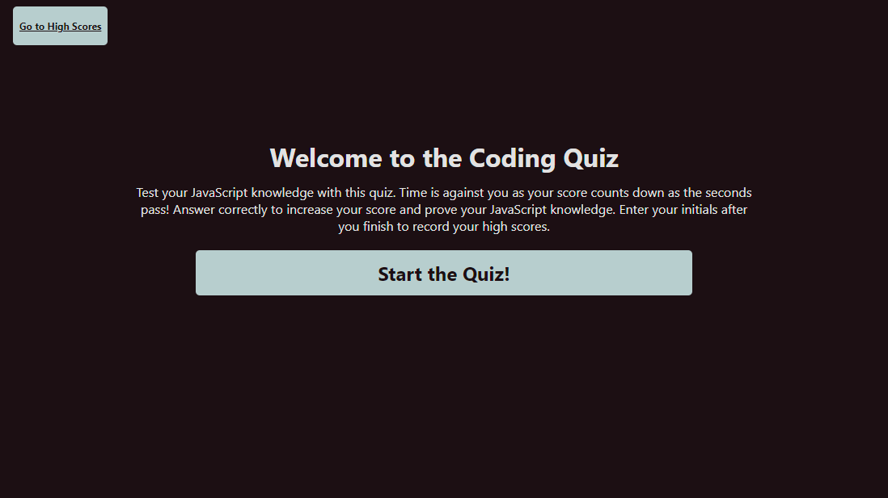
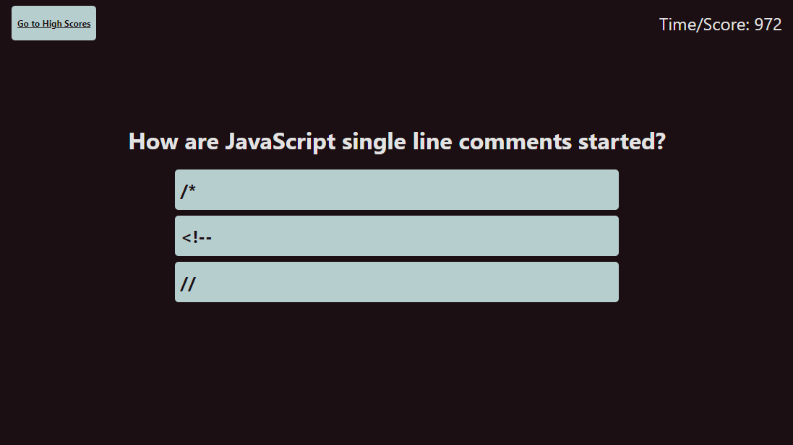

# coding-quiz-javascript

## Description

An interactive quiz app to show off your JavaScript Knowledge. Click 'Start the Quiz!' to start the timer and being answering questions; as you answer correctly your score increase. Built on HTML, CSS, and JavaScript, this quiz tracks your performance and records your score on each attempt. On the final screen, submit your initials to record your attempt and try again for a new high score. View your high scores by following the link in the corner of the app.

## Link

Link to [GitHub Pages](https://graybishop.github.io/coding-quiz-javascript/) deployment.

## Features

### Score Attack

Race against the clock to reach a high score. Your score is constantly decreasing over time. Get answers right and you gain points. Get them wrong, and lose more!

### High Score Board

At the end of the quiz, enter your initials to save your score. High scores are recorded on the score board, accessed through the link in the corner of every page.

## Screenshots

## Tech Stack

* HTML5
* CSS3
* JavaScript
